# Taghyeer Technology

A professional Flutter application built with a focus on **Clean Architecture**, scalability, and modern UI/UX principles. This project demonstrates a robust implementation of feature-driven development, state management with GetX, and functional error handling.

## 📱 Screenshots

### Welcome & Authentication
| Welcome | Light Sign In | Dark Sign In |
|:---:|:---:|:---:|
| 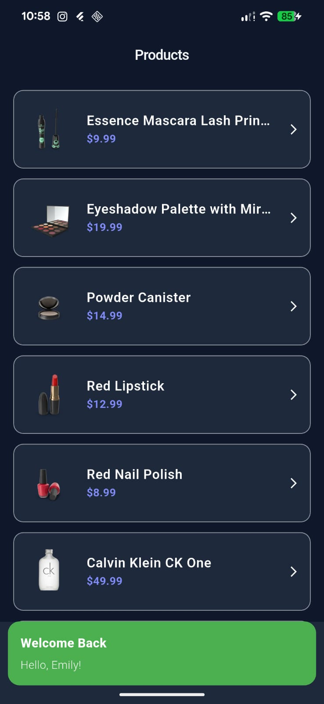 | 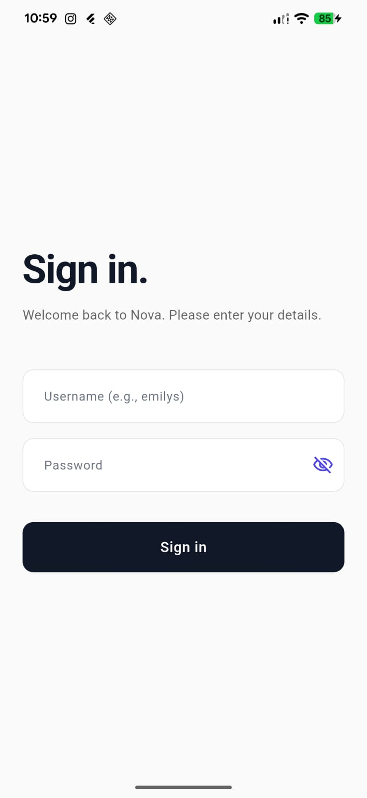 | 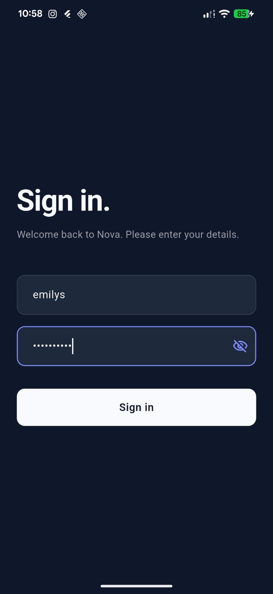 |

### Products
| Product List (Light) | Product List (Dark) | Product Details |
|:---:|:---:|:---:|
| 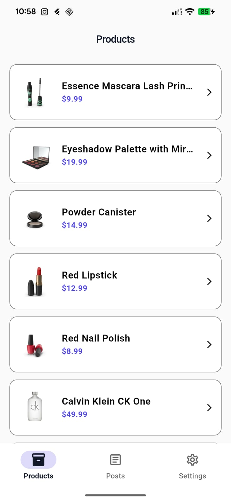 | 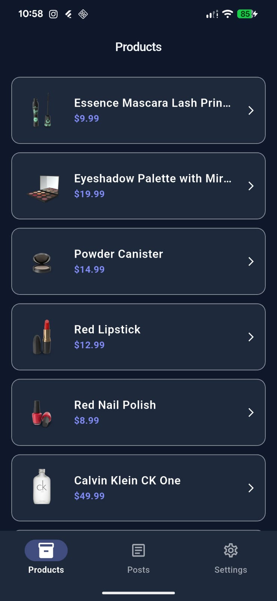 | 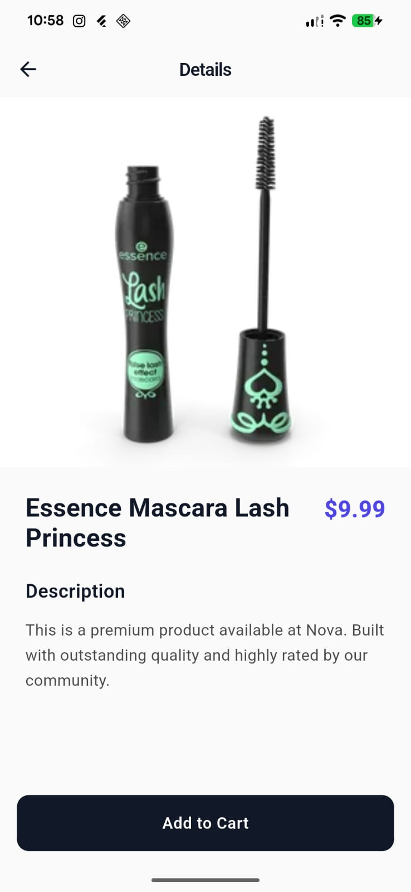 |

### Social Posts
| Post List (Light) | Post List (Dark) | Post Details |
|:---:|:---:|:---:|
| 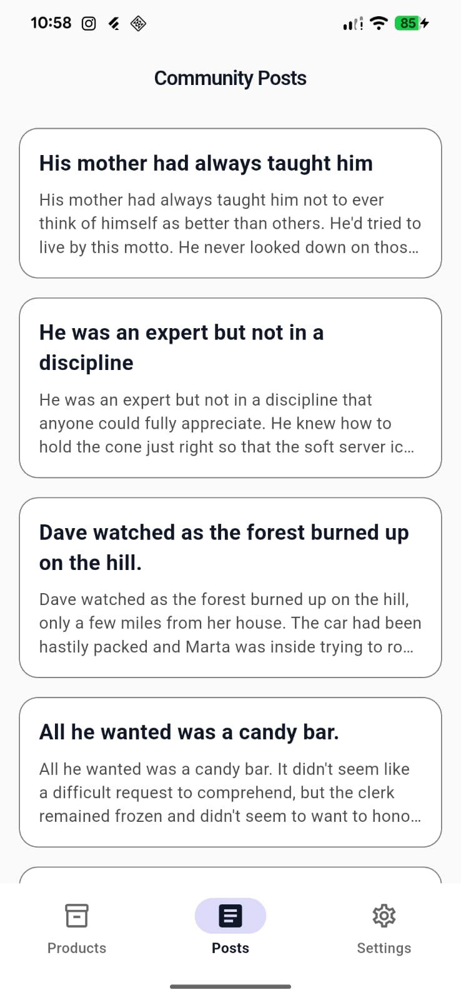 | 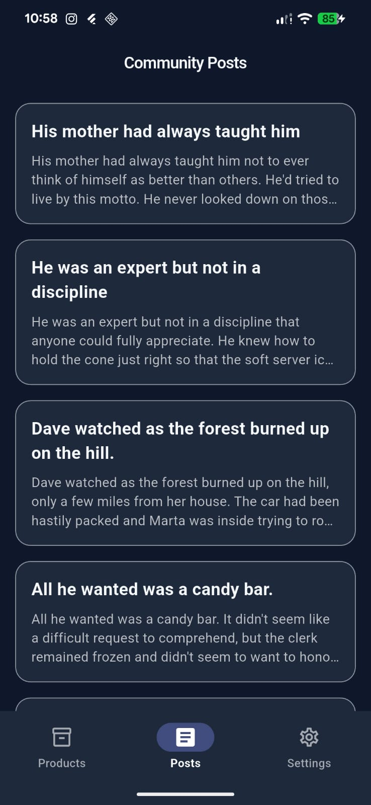 | 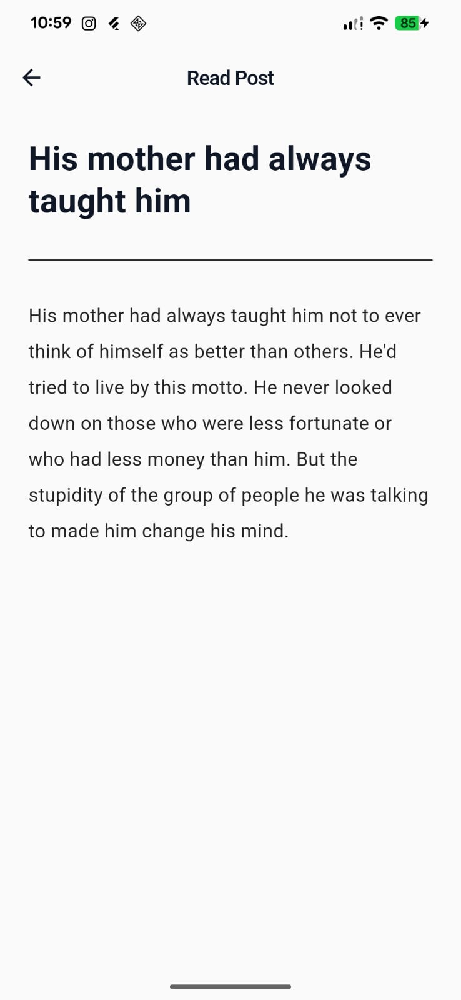 |

### Settings & Logout
| Settings (Light) | Settings (Dark) | Logout (Light) | Logout (Dark) |
|:---:|:---:|:---:|:---:|
| 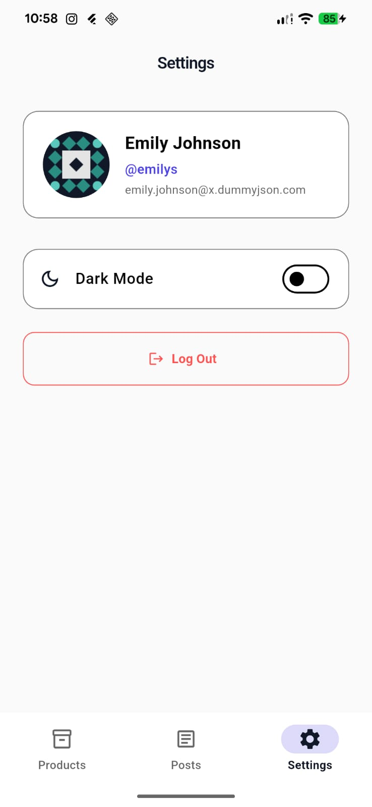 | 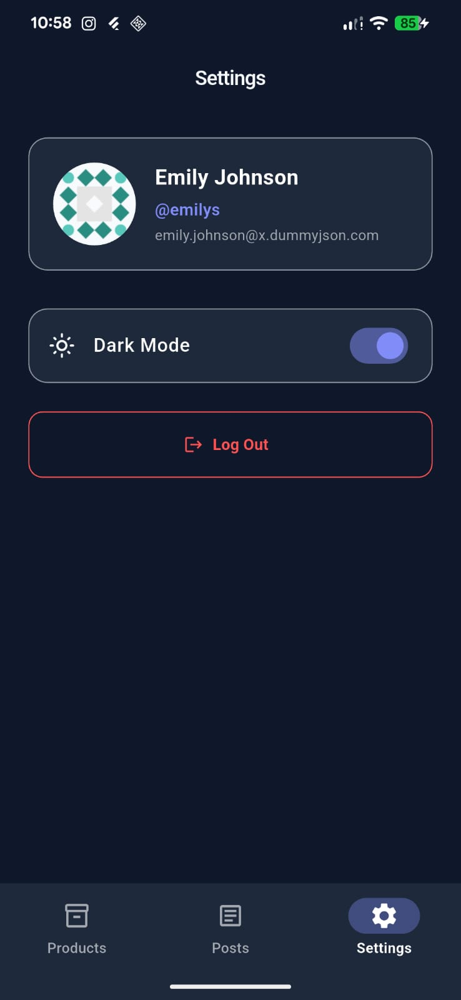 | 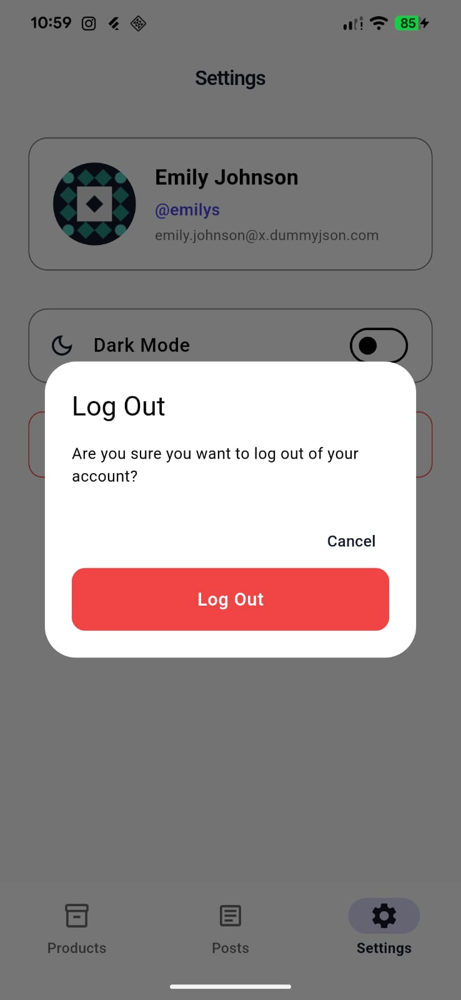 | 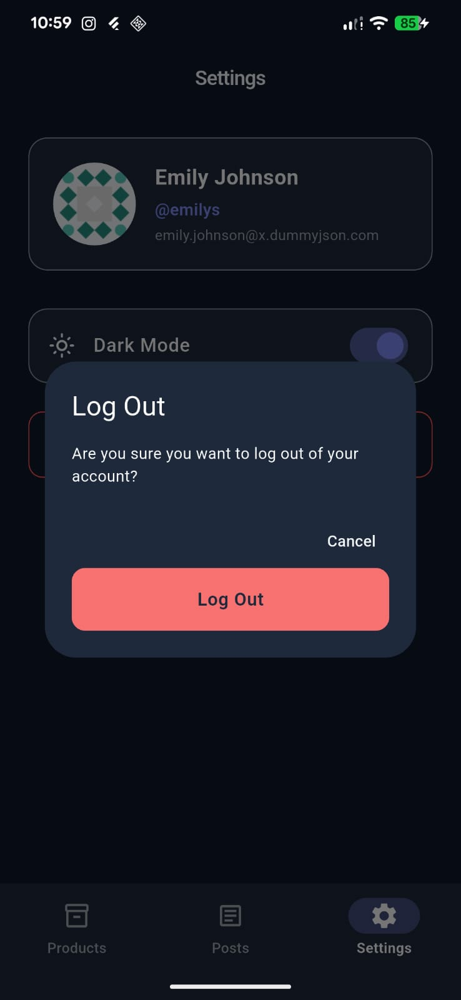 |

## 🚀 Key Features
- **User Authentication**: Secure login system with persistent session management using `shared_preferences`.
- **Product Management**: Browse a catalog of products with detailed views, optimized for performance.
- **Social Interaction**: A dedicated social feed for viewing and interacting with posts.
- **Dynamic Theming**: seamless transition between Light and Dark modes across the entire application.
- **Network Awareness**: Integrated real-time connectivity monitoring via `connectivity_plus`.
- **Error Handling**: Robust error management using the `fpdart` library for functional programming patterns (Either/Option).

## 🏗️ Project Architecture
The project follows **Clean Architecture** principles, organized by features to ensure high maintainability and testability:

- **Domain Layer**: The core of the application. Contains `Entities` (plain data objects), `UseCases` (business logic), and `Repository` interfaces.
- **Data Layer**: Responsible for data retrieval. Includes `Models` (JSON serialization), `DataSources` (Remote HTTP/Local storage), and `Repository Implementations`.
- **Presentation Layer**: The UI layer. Uses **GetX** for reactive state management, containing `Screens`, `Widgets`, and `Controllers`.

## 🛠️ Tech Stack
- **Framework**: [Flutter](https://flutter.dev)
- **State Management**: [GetX](https://pub.dev/packages/get)
- **Functional Programming**: [fpdart](https://pub.dev/packages/fpdart)
- **Networking**: [http](https://pub.dev/packages/http)
- **Local Storage**: [shared_preferences](https://pub.dev/packages/shared_preferences)
- **Utilities**: `connectivity_plus`, `intl`, `logger`, `url_launcher`

## 🏁 Getting Started
1. **Clone the repository**:
   ```bash
   git clone <repo-url>
   ```
2. **Install dependencies**:
   ```bash
   flutter pub get
   ```
3. **Run the application**:
   ```bash
   flutter run
   ```
